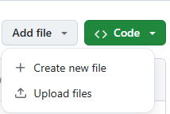

# TZYDataMining
# 个人信息
- **姓名**：谭志远
- **专业**：计算机技术
- **学号**：92342209
# 注册GitHub账户
1. 打开浏览器，搜索GitHub，访问 https://github.com 进入GitHub官网。
2. 找到 **Sign Up for GitHub** 按钮并点击，开始注册GitHub账号。  
  
3. 填写邮箱地址，设置密码，设置用户名,每次填写完都点 **Continue** 。  
  
4. 进行真人验证，首先点击验证  
  
&emsp;&emsp;根据左边的要求，在右边选择满足要求的图片，三次正确后验证完成。  
  
5. 网站会发送邮箱验证，查收验证邮件并输入验证码以完成注册。  
  
  
&emsp;&emsp;将邮箱的验证码正确填入就完成了  
6. 下面是github的欢迎页面，按要求填写团队人数和身份  
  
&emsp;&emsp;填写完成后来到工具选项页面,你可以选择感兴趣的工具。  
  
&emsp;&emsp;到这一步，注册账号就完成了。  
# 建立一个库 `xxDataMining`
1. 注册完成会来到账户的主页，点击左侧的 **Create repository** 建立个人仓库。  
  
&emsp;&emsp;点击后来到仓库建立页面,填写仓库信息，输入仓库名为TZYDataMining,设置仓库公开，并勾选 **Add a README file** 添加README文件,最后两个选项这里都选择None，就完成了仓库的建立。  
  
&emsp;&emsp;下面是创建完成后的页面  
  
2. PPT上传  
&emsp;&emsp;点击 **Add file** ,再点击 **Upload file** 进入上传文件页面。  
  
&emsp;&emsp;可以直接拖拽上传，也可以点击 **choose your file** 选择文件(PPT不能超过25M)  
  
&emsp;&emsp;上传文件后，点击 **Commit changes** 完成PPT的上传。  
  
# 学习目标：开发一个基于PyTorch的视频处理模型

## 背景
我的方向是和医学相关的医工结合交叉方向，我目前正在使用U-Net模型进行瞳孔分割。在最近的组会中，老师指出我所使用的高清灰度眼着图像数据集可能在实际应用中存在局限性。为了提高模型的实用性，需要使用更接近现实情况的数据集进行训练。

## 目标
我的目标是学习如何使用PyTorch或TensorFlow开发一个模型，该模型能够：

1. 从人脸视频中检测并追踪包含眼皮的眼眶。
2. 截取眼眶区域的图像。
3. 对截取的图像进行灰度化处理，同时尽可能保留细节。

## 预期成果
- 一个能够处理视频流并定位眼眶的视频处理模型。
- 一个灰度化处理流程，用于生成更具有一般性的数据集。
- 通过上述步骤得到的图像和眼睛数据，将更适用于实际患者使用。

## 学习计划
1. **视频处理技术学习**：研究如何从视频中检测和追踪眼眶。
2. **图像截取**：学习如何从视频中截取特定区域（眼眶）的图像。
3. **图像灰度化**：掌握图像处理技术，特别是如何将图像转换为灰度图像同时保留重要细节。
4. **PyTorch/TensorFlow实践**：通过实践，将所学技术应用于PyTorch或TensorFlow，开发出所需的模型。
5. **数据集构建**：使用开发的模型从手机拍摄的视频中生成新的数据集。

## 应用场景
- **医学图像分析**：提高模型在非理想条件下的性能，使其更适合于实际的临床环境。
- **帕金森病诊断**：通过分析眼睛运动，辅助帕金森病的早期诊断。

## 预期挑战
- 处理低质量视频数据时保持高准确度。
- 在灰度化过程中保留足够的特征信息以用于模型训练。

